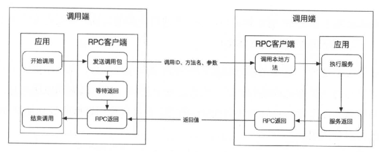
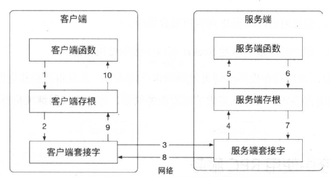
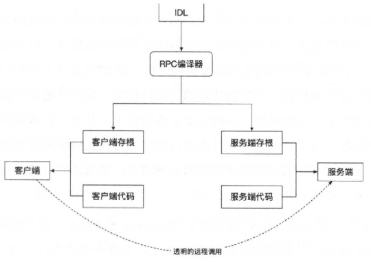
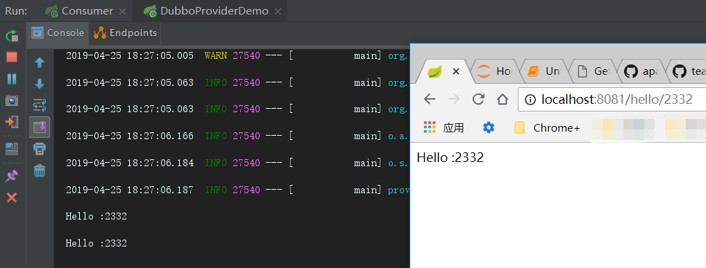

## RPC协议
> RPC采用客户端和服务端模式，请求程序的就是客户端
- RPC 协议以传输协议为基础（如TCP,UDP或者HTTP）,为两个不同的应用程序间传递数据，RPC在传输层和应用层之间。

### RPC 的优势
> 开发人员像调用本地方法一样调用远程服务。
- 简单，把繁琐的通信过程和唤起调用服务的过程都包装好了，便于使用
- 高效，高效的实现远程过程调用
- 通用，跨语言，RPC导出的服务可以供多个使用者用于不同的目的

### RPC 的原理

- 客户端调用本地的客户端存根，就像调用本地普通方法。真正执行发生在远程服务端。
客户端存根会将参数打包并封装成一个或多个网络消息体（编码后的字节数组）并发送到服务端。
- 客户端存根使用系统提供的Socket套接字接口向远程服务发送编码的网络消息。
- 网络消息由内核通过某种协议（无连接协议：UDP,面向连接协议:TCP）,传到远端
- 服务端存根收到消息解码成特定语言的格式
- 服务端调用本地方法执行完毕后又通过存根返回Socket
- 客户端存根再次从本地Socket接口读取结果消息，并将消息从网络二进制形式转换为本地语言格式。

### IDL （interface definition language）的接口定于语言
> 存根函数是从接口定义文件里面生成的，使各个语言可以通过RPC的机器相互调用服务，来实现服务的最大重用性。
- IDL 用来指定类的名称，属性和方法，不包含对象的实现。与语言无关

> RPC 介于会话层和表示层之间

### 主流的RPC框架
> Thrift，facebook 非常轻量级的RPC框架，在服务器上以阻塞模式，非阻塞模式，单线程模式，多线程模式等模式运行。
- 支持多语言，二进制格式传输数据，比XML和JSON的体积更小，在高并发，大数据量和多语言环境下更有优势。

> gRPC是Google开发的一个高性能的开源的RPC框架，使用ProtoBuf作为序列化工具和接口定义语言（IDL)

> Dubbo 提供三方面的功能
- 远程接口调用
- 负载均衡和容错
- 自动服务注册和发现

### 目录结构
- api
- consumer （依赖与api）
- provider （依赖与api）

ps: 映入的包全是 apache.dubbo

### provider 实现接口
在 porvider 中， 下面的配置都是必须的。

          spring:
            application:
              name: provider
          dubbo:
            scan:
              base-packages: provider
            protocol:
              name: dubbo
              port: 8087
            registry:
              address: N/A
          server:
            port: 8090
    
- PS： N/A 表示不在zookeeper上注册服务, `服务提供方` 和`消费方` 直接本地ip连接 

### consumer 里面直接调用接口

        @RestController
        public class ConsumerController {
        
            @Reference(version = "1.0.0", url ="dubbo://127.0.0.1:8087")
            private DemoService demoService;
        
            @GetMapping("hello/{name}")
            public Object getHello(@PathVariable String name) {
                return demoService.sayHello(name);
            }
        }
   
### provider 和 consumer 的 全部pom依赖
       <dependency>
              <groupId>org.springframework.boot</groupId>
              <artifactId>spring-boot-starter-web</artifactId>
              <version>2.0.6.RELEASE</version>
          </dependency>
  
          <dependency>
              <groupId>org.springframework.boot</groupId>
              <artifactId>spring-boot-starter</artifactId>
          </dependency>
  
          <dependency>
              <groupId>org.apache.dubbo</groupId>
              <artifactId>dubbo-spring-boot-starter</artifactId>
              <version>2.7.1</version>
          </dependency>
  
          <dependency>
              <groupId>org.apache.dubbo</groupId>
              <artifactId>dubbo</artifactId>
              <version>2.7.1</version>
          </dependency>

### 启动配置
        @SpringBootApplication
        @EnableAutoConfiguration
### 运行结果

